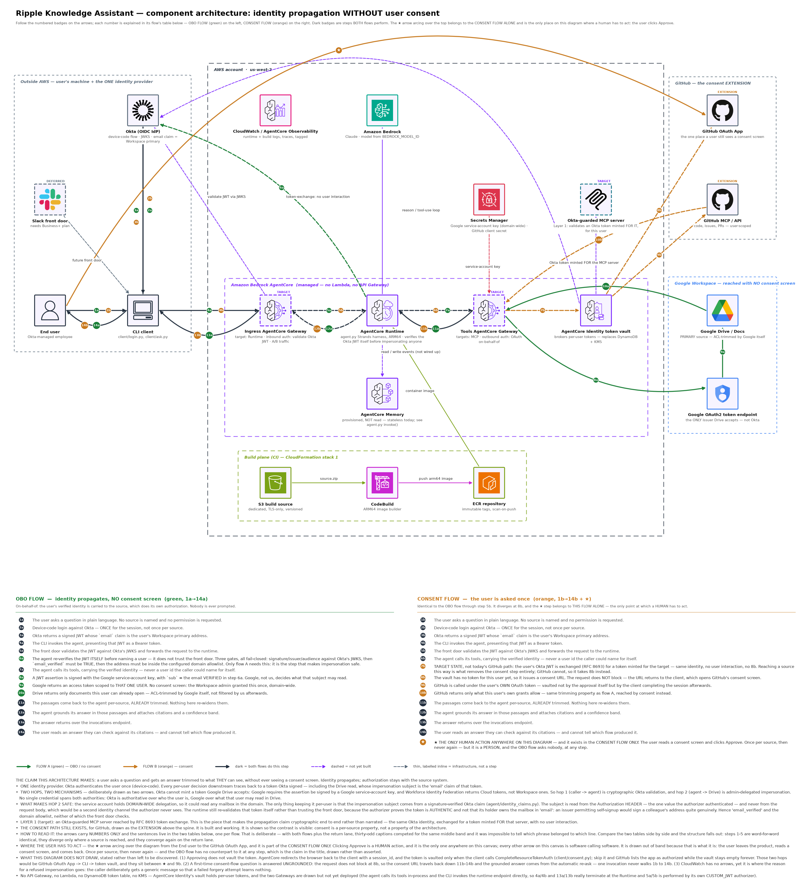
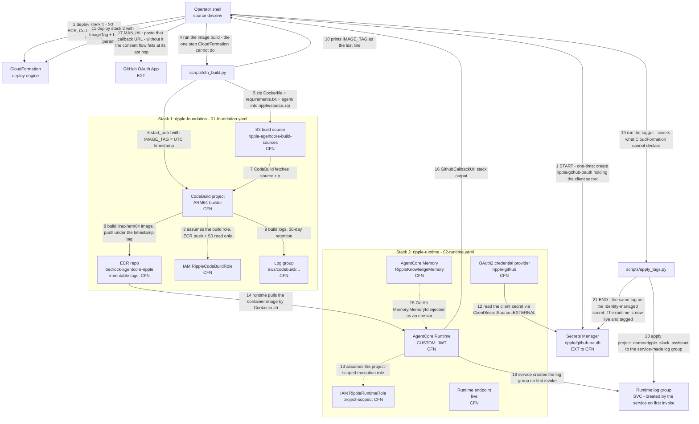
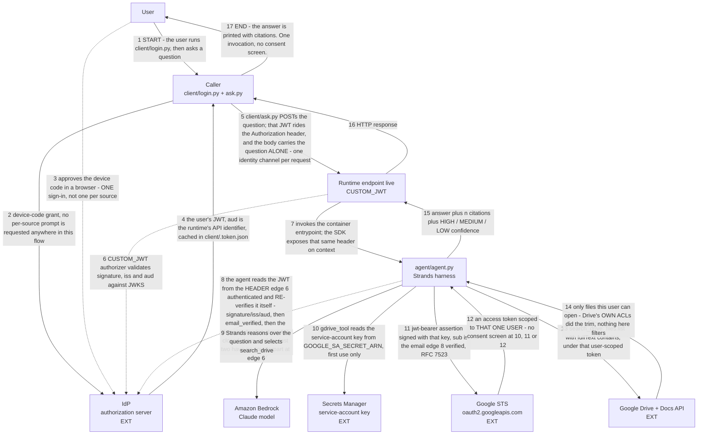
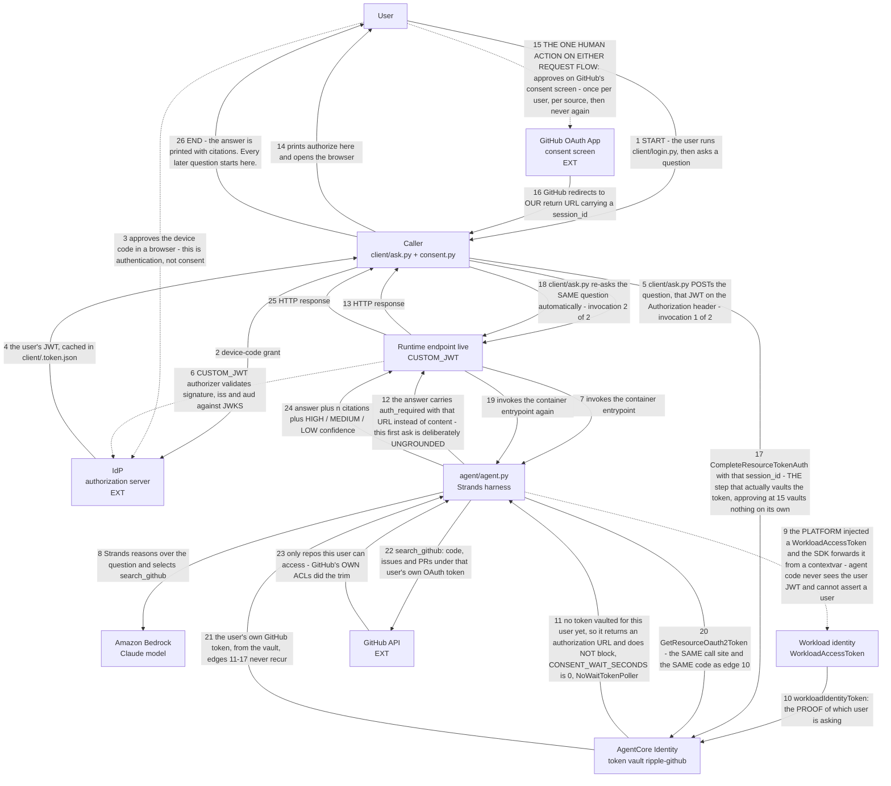

# Ripple — CloudFormation Architecture

Target architecture for the CloudFormation-based deployment (`infra/01-foundation.yaml`
+ `infra/02-runtime.yaml`). Every edge is numbered; the numbered tables below each
diagram are the authoritative text alternative.

Four views, kept separate because they answer different questions:

- **Component view.** What the pieces are and where the trust boundaries fall —
  the counterpart to the customer's own current-state diagram. The only view that
  draws both request flows on one canvas, which is why its steps carry `a` / `b`
  suffixes to tell them apart.
- **Deploy flow.** What the operator runs and what CloudFormation creates. Starts at
  an operator shell and ends at a live, tagged runtime endpoint — the one flow of the
  three with no end user in it.
- **OBO flow.** How a question is answered from a source that needs no consent screen
  (Google Drive). Starts and ends at the user, in **one** invocation.
- **Consent flow.** How a question is answered from a source that does need one
  (GitHub). Starts and ends at the user, but across **two** invocations, because a
  human acts in the middle and the runtime does not hold a request open for one.

The two request flows deliver the **same guarantee**: the source API is called with a
credential that represents the *user*, so the source itself trims the results to what
that user may read. Nothing in the agent filters afterwards. They differ only in **who
consents and who holds a long-lived credential** — never in who the source thinks is
asking.

## PNG versions

Ready to open, no tooling needed:

| View | PNG |
|---|---|
| Component architecture | [`architecture-components.png`](architecture-components.png) |
| Deploy flow | [`architecture-deploy-flow.png`](architecture-deploy-flow.png) |
| OBO flow — no consent screen | [`architecture-obo-flow.png`](architecture-obo-flow.png) |
| Consent flow — one click per user, per source | [`architecture-consent-flow.png`](architecture-consent-flow.png) |

**One diagram per flow, and the filename says which flow.** The three flow PNGs are the
numbered flows below drawn as sequence diagrams (one row per edge, read top to bottom),
and every numbered step on a canvas belongs to the flow its filename names. Each carries
exactly one `▶ START` and one `■ END` badge, on the lifelines they belong to; both
request flows close the loop back to the person who asked, which is the claim each of
them makes. The component PNG is a different shape on purpose — service tiles and
labelled connections rather than a numbered sequence — because it answers *what is
deployed and what talks to what*, which a strictly ordered sequence cannot show at a
glance, and it is the one drawing that puts both request flows on one canvas.

⚠️ **The components diagram numbers the two request stories differently.** There, steps
`1`–`5` are shared and the flows run `6a`–`14a` (OBO) and `6b`–`14b` (consent). Here the
numbering is per flow and contiguous: deploy `1`–`21`, OBO `1`–`17`, consent `1`–`26`.
Neither scheme is derived from the other, so a step number is meaningless without naming
the diagram it came from.

```bash
open infra/architecture-components.png infra/architecture-deploy-flow.png \
     infra/architecture-obo-flow.png infra/architecture-consent-flow.png
```

Regenerate:

```bash
python3 infra/render_diagrams.py           # the deploy, OBO and consent flow PNGs
python3 infra/render_diagrams.py --check   # assert edge numbers still match this file
python3 infra/render_components.py         # the component PNG
```

Both renderers use matplotlib only — no Node, no Docker, nothing leaves the machine.

`render_diagrams.py --check` compares the renderer's edge numbers against the
Mermaid blocks here and exits non-zero on drift, so the flow PNGs cannot silently
fall out of date. It runs automatically at the end of a normal render.

`render_components.py` refuses to write a PNG that fails any of its checks:

| Check | Catches |
|---|---|
| `trust_boundary_violations` | a node on the wrong side of the AWS account boundary |
| `zone_intrusions` | a zone box visually containing a tile that is not a member |
| `account_id_leaks` | an AWS account ID baked into a diagram meant to be shared |
| `arrows_through_tiles` | an arrow crossing a component it does not connect to |
| `missing_art` / `missing_glyphs` | a referenced icon file absent, or a glyph missing from the render font |
| (post-render) | overlapping text |

The first two matter most. `trust_boundary_violations` is what stops the dashed
account rectangle from claiming to contain the IdP or GitHub; `zone_intrusions`
exists because an early draft drew CloudWatch inside the AgentCore box, asserting
CloudWatch is part of AgentCore rather than a service AgentCore reports into.

Every tile carries an official icon — AgentCore from the AWS AgentCore deck, AWS
services from the AWS Architecture Icons package, and Slack / GitHub / Okta / Google
from their own brand marks. Provenance for each file is in
[`icons/SOURCE.md`](icons/SOURCE.md).

## Component architecture



Read it left to right — the columns are the trust boundary, and the dashed zone boxes are
where it falls:

| Zone | Contains | Why it matters |
|---|---|---|
| Outside AWS — the caller | The user, their machine, the Slack front door, and the one identity provider | The JWT is minted by an IdP we do not host |
| The AWS account | Everything CloudFormation owns and cost-tags, including the managed AgentCore box and the build plane | One owner per resource, so the cost tag and the IAM scoping are truthful |
| Outside AWS — Google Workspace | Drive + Docs and Google's own token endpoint | Reached with no consent screen, and still ACL-trimmed by Google |
| Outside AWS — GitHub | The GitHub API and its OAuth App | The system of record, and the ACL authority, reached after one consent click |

Google and GitHub are drawn as two separate zones rather than one "external sources" box:
they are different authorities reached by different mechanisms, and one box around both
would imply the no-consent property is a column-wide fact rather than a per-source one.

Two arrows carry the security argument, and they are deliberately distinct:

- `AgentCore Runtime → token vault → GitHub` — the vault performs the per-user
  OAuth exchange and hands back a token scoped to **that one user**.
- `AgentCore Runtime → GitHub API` (the bowed arrow, drawn *around* the vault) —
  the agent then calls GitHub **directly** under that token. It is bowed rather
  than straight precisely so it cannot be misread as flowing through the vault.

The consequence is the whole point: GitHub itself trims the results, so the agent
has no path to widen a user's access even if the prompt asks it to.

## State model

**Every layer of this solution is stateless per request. That is a deliberate
choice, not an unfinished one.** It is worth stating plainly because a reader
looking at the diagram will see an AgentCore Memory tile and reasonably assume
conversations persist. They do not — the Memory resource is provisioned and
unused.

| Layer | Today | Where the switch is |
|---|---|---|
| CLI client | New session id every run, so no two invocations are grouped | `client/ask.py` — persist the id instead of minting it |
| Runtime entrypoint | Fresh `Agent` per invocation; reads no history, writes none | `agent/agent.py` `invoke()` — see the STATEFUL block in its docstring |
| AgentCore Memory | Created by `02-runtime.yaml`, id injected as `AGENTCORE_MEMORY_ID`, never read | No infra change needed; wire up the read/write |
| Tools Gateway (MCP) | Not built yet | Pin `supportedVersions` when built — see below |

What statelessness buys, concretely: any runtime instance can serve any turn, so
scaling out needs no sticky routing and a cold start loses nothing; and cross-user
bleed is impossible by construction, because there is no shared container for one
user's data to land in another user's turn.

What it costs: follow-up questions don't work. "What did I just ask?" gets nothing.

### The session id is not memory

`client/ask.py` sends `X-Amzn-Bedrock-AgentCore-Runtime-Session-Id`, and it would
be easy to read that as conversation state. It is not. The platform uses it to
group turns for observability and billing; `agent.py` never reads it, so it cannot
influence an answer. Grouping is not memory.

### Going stateful

The full recipe is in `invoke()`'s docstring in `agent/agent.py`, next to the code
it changes. Three things there are load-bearing and easy to get wrong:

1. **Take the conversation id from `context`, never from `payload`.** A
   client-supplied conversation id is a cross-user read primitive — anyone can
   pass someone else's.
2. **`user_sub` is the authorization boundary, the session id only separates
   conversations within it.** Scope by both; the JWT-derived `sub` is the one that
   makes it safe.
3. **Retrieved history is not a citable source.** Keep it out of the Sources list,
   or the confidence band starts vouching for the model's own earlier claims — a
   self-confirming loop.

Then budget it with a turn cap or token budget of your own. The Memory resource's
`EventExpiryDuration` (`MemoryExpiryDays`, default 90) caps *retention*, not
context size, so it won't help: unbounded history raises cost every turn and
eventually pushes the system prompt out of the window. And stored conversation is
user data, so deletion becomes a real code path.

### MCP 2026-07-28 and the Tools Gateway

The [MCP 2026-07-28 spec](https://aws.amazon.com/blogs/machine-learning/how-agentcore-gateway-supports-the-mcp-2026-07-28-spec/)
moved MCP in the same direction: protocol-level sessions are gone (no
`Mcp-Session-Id`, no `initialize` handshake), every tool call is self-contained,
and application state is carried in explicit tool parameters instead. Which means
our Tools Gateway needs no session infrastructure when we build it, and the
stateless design above is the one the protocol now assumes.

When the Gateway is built, **pin the version explicitly** — a Gateway created
without `supportedVersions` serves `2025-03-26` to any client that omits the
`MCP-Protocol-Version` header:

```bash
aws bedrock-agentcore-control update-gateway --gateway-identifier "$GW_ID" \
  --protocol-configuration '{"mcp":{"supportedVersions":["2025-11-25","2026-07-28"]}}'
```

Two traps. `update-gateway` **replaces** the array rather than appending, so send
the complete desired list or you silently drop a version a client still uses. And
version translation does not cover elicitation or sampling, so a `2025-*` client
calling a `2026-*` server tool that needs either fails with `-32021` — roll clients
forward before removing old versions. Changing the protocol version does not touch
the inbound authorizer or the outbound OAuth credential provider, so the per-user
GitHub token flow is unaffected.

### How to view the Mermaid source

The `mermaid` blocks below render natively in several places — no install:

- **GitHub / GitLab** — rendered automatically in the web UI for any `.md` file.
- **VS Code** — the built-in Markdown preview (`Cmd+Shift+V`) renders Mermaid as of
  VS Code 1.100; older versions need the *Markdown Preview Mermaid Support* extension.
- **<https://mermaid.live>** — paste a block's contents (without the ``` fences) and
  export PNG or SVG from the *Actions* panel. Note this sends the diagram to a
  third-party site; fine for this architecture, not for anything sensitive.
- **JetBrains IDEs** — Markdown preview with the Mermaid plugin enabled.

To generate PNGs from the Mermaid source itself rather than via
`render_diagrams.py`, you need Node (not currently installed on this machine):

```bash
brew install node
npx -y @mermaid-js/mermaid-cli -i infra/ARCHITECTURE.md -o /tmp/arch.md
# writes /tmp/arch-1.png … /tmp/arch-3.png, one per mermaid block:
# the deploy flow, the OBO flow, the consent flow
```

`render_diagrams.py` exists precisely so the PNGs do not depend on that: it uses
only matplotlib, works offline, and sends nothing to a third party.

Legend used throughout:

```
  [CFN]  created and owned by CloudFormation
  [SVC]  created by the AWS service at first use, tagged by scripts/apply_tags.py
  [EXT]  external to AWS and to CloudFormation
  [OPS]  a manual operator step
  [ENG]  the CloudFormation service itself (the deploy engine)
```

---

## Deploy flow

What the operator runs and what CloudFormation creates. **START** is the operator shell;
**END** is a live, tagged runtime endpoint. This is the one flow of the three that does
not return to an end user, because no end user takes part in it.

Edges 2 and 11 target the CloudFormation service, which then creates the `[CFN]`
resources grouped below as stack 1 and stack 2. The runtime endpoint `live` is created by
edge 11 but sends no deploy-time message of its own — it is where the OBO and consent
flows both begin their authenticated invoke.



### Deploy flow — numbered edges (text alternative)

| # | From | To | What happens |
|---|---|---|---|
| **1** | Operator shell | Secrets Manager | **START.** One-time: create `ripple/github-oauth` holding `{"client_secret": ...}` |
| 2 | Operator shell | CloudFormation | Deploy stack 1 → S3, ECR, CodeBuild, build role, log group |
| 3 | CodeBuild | `RippleCodeBuildRole` | Assumes the build role (ECR push + S3 read only) |
| 4 | Operator shell | `cfn_build.py` | Run the image build — the one step CloudFormation cannot do |
| 5 | `cfn_build.py` | S3 | Zip `Dockerfile` + `requirements.txt` + `agent/` → `ripple/source.zip` |
| 6 | `cfn_build.py` | CodeBuild | `start_build` with `IMAGE_TAG` = UTC timestamp |
| 7 | S3 | CodeBuild | CodeBuild fetches `source.zip` |
| 8 | CodeBuild | ECR | Build `linux/arm64` image, push under the timestamp tag |
| 9 | CodeBuild | CodeBuild log group | Build logs (30-day retention) |
| 10 | `cfn_build.py` | Operator shell | Prints `IMAGE_TAG=<tag>` as the last line |
| 11 | Operator shell | CloudFormation | Deploy stack 2 with `ImageTag` + IdP / GitHub parameters |
| 12 | OAuth2 provider `ripple-github` | Secrets Manager | Read the client secret via `ClientSecretSource=EXTERNAL` |
| 13 | AgentCore Runtime | `RippleRuntimeRole` | Assumes the project-scoped execution role |
| 14 | ECR | AgentCore Runtime | Runtime pulls the container image by `ContainerUri` |
| 15 | AgentCore Memory | AgentCore Runtime | `!GetAtt Memory.MemoryId` injected as an env var |
| 16 | AgentCore Runtime | Operator shell | `GithubCallbackUrl` stack output |
| 17 | Operator shell | GitHub OAuth App | **Manual:** paste that callback URL — without it the consent flow fails at its last hop |
| 18 | AgentCore Runtime | Runtime log group | Service creates the log group on first invoke |
| 19 | Operator shell | `apply_tags.py` | Run the tagger — covers what CloudFormation cannot declare |
| 20 | `apply_tags.py` | Runtime log group | Apply `project_name=ripple_slack_assistant` to the service-made log group |
| **21** | `apply_tags.py` | Secrets Manager | **END.** The same tag on the Identity-managed secret; the runtime is now live and tagged |

Edge 17 is the only step that can block a cutover, and only because replacing the
credential provider issues a new callback URL.

### Deploy flow — ASCII fallback

```
  [OPS] Operator shell  (source dev.env)
     |
     | (1) START: create ripple/github-oauth  (one time)
     v
  +-------------------------------------------+
  |  Secrets Manager  ripple/github-oauth     |  [EXT to CFN]
  +-------------------------------------------+
     ^                                     ^
     | (12) read secret (EXTERNAL)         | (21) END: the same tag on
     |                                     |      the Identity secret
     |   (2) deploy stack 1 --> [ENG] CloudFormation, which creates:
     |     +-------------------------------------------------+
     |     |  STACK 1  ripple-foundation  (01-foundation)    |
     |     |                                                 |
     |     |  +-------------+   (3) assumes  +-------------+  |
     |     |  |  CodeBuild  | -------------> |  CB Role    |  |
     |     |  +-------------+                +-------------+  |
     |     |    ^   |    |                                    |
     |     |    |   |    +--- (9) logs ---> +-------------+   |
     |     |    |   |                       |  CB LogGrp  |   |
     |     |    |   |                       +-------------+   |
     |     |    |   +--- (8) push image --> +-------------+   |
     |     |    |                           |  ECR repo   |   |
     |     |    | (7) fetch source.zip      +-------------+   |
     |     |  +-------------+                     |           |
     |     |  |  S3 source  |                     |           |
     |     |  +-------------+                     |           |
     |     +-------------------------------------------------+
     |           ^                                |
     |           | (5) upload zip                 | (14) pull image
     |           |                                |
     |     +-------------+                        |
     |     | cfn_build   | -- (6) start_build     |
     |     +-------------+                        |
     |        ^     |                             |
     | (4) run|     | (10) print IMAGE_TAG        |
     |        |     v                             |
     |     [OPS] Operator                         |
     |           |                                |
     |           | (11) deploy stack 2  -->  [ENG] CloudFormation
     |           v                                v
     |     +-------------------------------------------------+
     |     |  STACK 2  ripple-runtime  (02-runtime)          |
     |     |                                                 |
     +-----|--- Credential provider  ripple-github           |
           |         |                                       |
           |  +-------------+  (13) assumes  +------------+   |
           |  |   Runtime   | -------------> |  RT Role   |   |
           |  +-------------+                +------------+   |
           |     ^      |                                     |
           |     |      | (16) GithubCallbackUrl output       |
           |     | (15) MemoryId as an env var                |
           |  +-------------+          Runtime endpoint  live |
           |  |   Memory    |          (no deploy-time msg;   |
           |  +-------------+           the request flows      |
           |                            start here)           |
           +-------------------------------------------------+
                    |                    |
                    | (18) service makes | (16) output
                    |      it on first   v
                    v      invoke   [OPS] Operator
           +------------------+          |
           | Runtime LogGroup |          | (17) MANUAL: paste the callback
           |      [SVC]       |          |      URL, or the consent flow
           +------------------+          v      fails at its last hop
                    ^              +------------------+
                    | (20) tag     | GitHub OAuth App |
                    |              |      [EXT]       |
           +------------------+    +------------------+
           |  apply_tags.py   |
           +------------------+
                    ^
                    | (19) run
              [OPS] Operator
```

---

## OBO flow

Answering from Google Drive, the source that needs no consent screen. **START and END are
both the user**, and exactly **one** invocation sits between them: the question asked at
edge 1 is answered at edge 17 without interruption. The only interactive step is the
sign-in at edge 3, and it is one sign-in rather than one per source.

**No consent screen exists anywhere on this flow.** The Workspace admin granted
domain-wide delegation once, for `drive.readonly` alone; every user afterwards is
impersonated without being asked. The sign-in at edge 3 is authentication, not consent.

The load-bearing steps are 8 and 11. Edge 8 is the agent re-verifying the user's JWT
itself — three fail-closed gates — and edge 11 is the assertion whose `sub` is the email
that verification produced. **Impersonation is safe only because 8 precedes 11:** the
service account can impersonate any user in the domain, so `sub` may come only from a
signature-verified claim. A caller-supplied email there turns the per-user trim into a
domain-wide read with every log line still looking normal.



### OBO flow — numbered edges (text alternative)

| # | From | To | What happens |
|---|---|---|---|
| **1** | User | Caller | **START.** The user runs `client/login.py`, then asks a question |
| 2 | Caller | IdP | Device-code grant; no per-source prompt is requested anywhere in this flow |
| 3 | User | IdP | Approves the device code in a browser — **one** sign-in, not one per source |
| 4 | IdP | Caller | The user's JWT, `aud` = the runtime's API identifier; cached in `client/.token.json` |
| 5 | Caller | Runtime endpoint | `client/ask.py` POSTs the question; that JWT rides the `Authorization` header, and the body carries the question **alone** — one identity channel per request |
| 6 | Runtime endpoint | IdP | `CUSTOM_JWT` authorizer validates signature, `iss` and `aud` against JWKS |
| 7 | Runtime endpoint | Agent | Invokes the container entrypoint; the SDK exposes that same header on `context` |
| 8 | Agent | IdP | The agent reads the JWT from the **header edge 6 authenticated** and **re-verifies** it itself: signature / `iss` / `aud`, then `email_verified`, then the domain allowlist — three fail-closed gates, and the last two have no counterpart at edge 6 |
| 9 | Agent | Bedrock | Strands reasons over the question and selects `search_drive` |
| 10 | Agent | Secrets Manager | `gdrive_tool` reads the service-account key from `GOOGLE_SA_SECRET_ARN`, first use only |
| 11 | Agent | Google STS | `jwt-bearer` assertion signed with that key, `sub` = the email edge 8 verified (RFC 7523) |
| 12 | Google STS | Agent | An access token scoped to **that one user** — no consent screen at 10, 11 or 12 |
| 13 | Agent | Google Drive | `search_drive`: `files.list` with `fullText contains`, under that user-scoped token |
| 14 | Google Drive | Agent | Only files this user can open — Drive's **own** ACLs did the trim; nothing here filters |
| 15 | Agent | Runtime endpoint | Answer + `[n]` citations + HIGH / MEDIUM / LOW confidence |
| 16 | Runtime endpoint | Caller | HTTP response |
| **17** | Caller | User | **END.** The answer is printed with citations. One invocation, no consent screen |

**Two authorities, two hops, and they cannot be collapsed into one.** The IdP is
authoritative over who the user is (edges 6, 8); Google is authoritative over what they
may read in Drive (edges 11–14). Google's `jwt-bearer` grant requires the assertion be
signed by a Google **service account** key, so no IdP-issued token is accepted at edge 11
however both sides are configured. IdP SSO into Workspace is convenience; it is not what
makes edge 11 work.

**One identity channel, which is why edges 6 and 8 cannot disagree.** Edge 5 carries the
JWT on the `Authorization` header only; the request body holds the question. Edge 8 reads
that same header (`agent/agent.py` `_caller_jwt()`), so the token the authorizer
authenticated at 6 and the token naming the impersonated user at 11 are one value.
Accepting an identity from the body as well would let a caller pair a valid header for
themselves with a valid body token naming a colleague — both verify, and edge 11 would
follow the body.

**Edge 8 is not redundant with edge 6**, though it re-checks the same signature. Edge 6
proves the token is *authentic*; it does not prove its holder owns the mailbox in `email`.
An issuer permitting self-signup signs a colleague's address quite genuinely, so
`email_verified` and the domain allowlist exist only at edge 8 — and edge 11 is a
domain-wide read primitive without them.

### OBO flow — ASCII fallback

```
  START at (1) and END at (17) are the SAME participant: the user.
  ONE invocation, and no consent screen anywhere below.

  +------------------+
  |  User            |  [OPS]
  +------------------+
     |            ^
 (1) | START      | (17) END: the answer, printed with citations
     v            |
  +------------------------------------+
  |  Caller  client/login.py + ask.py  |  [OPS]
  +------------------------------------+
     |            ^          |         ^
 (2) | device     | (4) the  | (5)     | (16) HTTP response
     |    code    |     JWT  |  ask    |
     v            |          |         |
  +------------------------------+     |
  |  IdP  authorization server   |     |   <--- (3) user approves the
  |  [EXT]                       |     |            device code. ONE
  +------------------------------+     |            sign-in, not one
     ^                    ^            |            per source
     |                    |            v
     | (6) front-door     |    +----------------------------------+
     |     validation     |    |  Runtime endpoint  live          |
     |                    |    |  CUSTOM_JWT authorizer           |
     |                (8) |    +----------------------------------+
     |     the agent      |            |              ^
     |     RE-verifies    |        (7) | invoke       | (15) cited answer
     |     the JWT        |            v              |
     |     ITSELF         |    +----------------------------------+
     +--------------------+----|  agent/agent.py  Strands harness |
                               +----------------------------------+
                        |          |             |          ^
                    (9) |     (10) |        (11) |     (12) | a token
                 reason |   SA key |   assertion |          | scoped to
                        v          v             v          | ONE user
                  +-----------+ +-----------+ +----------------------+
                  |  Bedrock  | |  Secrets  | |  Google STS          |
                  |  Claude   | |  Manager  | |  oauth2.googleapis   |
                  |           | |  [EXT]    | |  [EXT]               |
                  +-----------+ +-----------+ +----------------------+
                                                    |
                                               (13) | search_drive under
                                                    | that user-scoped
                                                    v token
                                    +------------------------------+
                                    |  Google Drive + Docs API     |
                                    |  [EXT]                       |
                                    +------------------------------+
                                                    |
                              (14) only files this  |
                              user can open. Drive's|
                              OWN ACLs did the trim;v
                              nothing here filters. agent/agent.py
```

---

## Consent flow

Answering from GitHub, the source that cannot do the OBO exchange: its token endpoint
answers the exchange grant with `unsupported_grant_type` — verified empirically, not
assumed — so the user's own OAuth token has to be brokered and vaulted instead.

**START and END are both the user, but two invocations sit between them** (edges 5 and
18), because a human acts in the middle and the runtime will not hold a request open for
one (`CONSENT_WAIT_SECONDS = 0`, `NoWaitTokenPoller`). Edges 1–14 answer nothing; edges
18–26 answer the same question. That is why this flow is half again as long as the OBO
one: the first ask returns a URL instead of content, and the client re-asks afterwards.

**Approving is not vaulting.** Edge 15 is the click; edge 17 is what stores the token. If
the return URL is not registered, or the client never completes the session, the user
will have approved and the vault will still be empty — and the first ask then repeats
forever with no error naming the cause.

Edges 9–10 carry the containment argument. **The agent never passes the user's JWT to
AgentCore Identity.** The platform injects a `WorkloadAccessToken` that agent code cannot
mint; the SDK forwards it from a contextvar as `workloadIdentityToken`; Identity resolves
*which user* from that. A compromised agent therefore cannot request Bob's token while
Alice is calling — it has no way to assert "Bob".



### Consent flow — numbered edges (text alternative)

| # | From | To | What happens |
|---|---|---|---|
| **1** | User | Caller | **START.** The user runs `client/login.py`, then asks a question |
| 2 | Caller | IdP | Device-code grant |
| 3 | User | IdP | Approves the device code in a browser — this is authentication, not consent |
| 4 | IdP | Caller | The user's JWT, cached in `client/.token.json` |
| 5 | Caller | Runtime endpoint | `client/ask.py` POSTs the question, that JWT on the `Authorization` header — **invocation 1 of 2** |
| 6 | Runtime endpoint | IdP | `CUSTOM_JWT` authorizer validates signature, `iss` and `aud` against JWKS |
| 7 | Runtime endpoint | Agent | Invokes the container entrypoint |
| 8 | Agent | Bedrock | Strands reasons over the question and selects `search_github` |
| 9 | Agent | Workload identity | The **platform** injected a `WorkloadAccessToken` and the SDK forwards it from a contextvar — agent code never sees the user JWT and cannot assert a user |
| 10 | Workload identity | Token vault | `workloadIdentityToken`: the **proof** of which user is asking |
| 11 | Token vault | Agent | No token vaulted for this user yet, so it returns an authorization URL and does **not** block (`CONSENT_WAIT_SECONDS = 0`, `NoWaitTokenPoller`) |
| 12 | Agent | Runtime endpoint | The answer carries `auth_required` with that URL instead of content — this first ask is deliberately **ungrounded** |
| 13 | Runtime endpoint | Caller | HTTP response |
| 14 | Caller | User | Prints "authorize here" and opens the browser |
| 15 | User | GitHub OAuth App | ★ **The one human action on either request flow:** approves on GitHub's consent screen — once per user, per source, then never again |
| 16 | GitHub OAuth App | Caller | GitHub redirects to **our** return URL carrying `?session_id=...` |
| 17 | Caller | Token vault | `CompleteResourceTokenAuth(session_id)` — **the** step that actually vaults the token; approving at 15 vaults nothing on its own |
| 18 | Caller | Runtime endpoint | `client/ask.py` re-asks the **same** question automatically — **invocation 2 of 2** |
| 19 | Runtime endpoint | Agent | Invokes the container entrypoint again |
| 20 | Agent | Token vault | `GetResourceOauth2Token` — the same call site and the same code as edge 10 |
| 21 | Token vault | Agent | The user's own GitHub token, from the vault; edges 11–17 never recur |
| 22 | Agent | GitHub API | `search_github`: code, issues and PRs under that user's own OAuth token |
| 23 | GitHub API | Agent | Only repos this user can access — GitHub's **own** ACLs did the trim |
| 24 | Agent | Runtime endpoint | Answer + `[n]` citations + HIGH / MEDIUM / LOW confidence |
| 25 | Runtime endpoint | Caller | HTTP response |
| **26** | Caller | User | **END.** The answer is printed with citations. Every later question starts here |

**The guarantee is the same one the OBO flow makes.** Edge 22 calls GitHub with a token
representing the **user**, so GitHub itself trims the results. GitHub is on this flow
because it has to be, not by choice: the OBO flow needs the *source* to accept a brokered
assertion, and SSO into a vendor is not that.

### Consent flow — ASCII fallback

```
  START at (1) and END at (26) are the SAME participant: the user.
  TWO invocations, drawn in order. (1)-(14) answer nothing.

  SIGN IN ONCE
  +------------------+
  |  User            |  [OPS]
  +------------------+
     |            ^
 (1) | START      | (4) via the caller: the user's JWT
     v            |
  +---------------------------------------+
  |  Caller  client/ask.py + consent.py   |  [OPS]
  +---------------------------------------+
     |            ^
 (2) | device     | (4)
     |    code    |
     v            |
  +------------------------------+
  |  IdP  authorization server   |     <--- (3) user approves the device
  |  [EXT]                       |              code. Authentication,
  +------------------------------+              NOT consent.

  INVOCATION 1 OF 2 -- no token vaulted yet, so no content comes back
     Caller
       |                    ^
   (5) | question + Bearer  | (13) HTTP response
       v                    |
  +----------------------------------+
  |  Runtime endpoint  live          |  (6) validates the JWT against JWKS
  |  CUSTOM_JWT authorizer           |
  +----------------------------------+
       |                    ^
   (7) | invoke             | (12) auth_required with a URL INSTEAD of
       v                    |      content. This first ask is UNGROUNDED.
  +----------------------------------+       (8) --> Bedrock: select
  |  agent/agent.py  Strands harness |            search_github
  +----------------------------------+
       |                    ^
   (9) | the PLATFORM       | (11) an authorization URL. Does NOT block
       |   injected a       |      (CONSENT_WAIT_SECONDS = 0).
       |   WorkloadAccess-  |
       v   Token            |
  +------------------------------+    |
  |  Workload identity           |    |
  |  WorkloadAccessToken         |    |
  +------------------------------+    |
       |                              |
  (10) | the PROOF of which user      |
       v   is asking                  |
  +------------------------------------------+
  |  AgentCore Identity  token vault         |
  |  ripple-github                           |
  +------------------------------------------+
       ^                    ^
       | (17) Complete-     |
       |   ResourceToken-   |  (14) the caller prints "authorize here"
       |   Auth(session_id) |       and opens the browser
       |   THE step that    v
       |   vaults        [OPS] User
       |                    |
       |               (15) | THE ONE HUMAN ACTION ON EITHER REQUEST
       |                    |   FLOW: once per user, per source
       |                    v
       |          +------------------------------+
       +----------|  GitHub OAuth App  [EXT]     |
                  |  consent screen              |
                  +------------------------------+
              (16) redirects to OUR return URL with ?session_id=...

  INVOCATION 2 OF 2 -- the SAME question, now grounded
     Caller -- (18) re-asks automatically --> Runtime endpoint
                                                  |         ^
                                             (19) | invoke  | (24) cited
                                                  v         |      answer
                                       +----------------------------------+
                                       |  agent/agent.py                  |
                                       +----------------------------------+
                                             |         ^
                                        (20) | Get-    | (21) the user's own
                                             | Resource|   GitHub token, from
                                             | Oauth2- |   the vault. (11)-(17)
                                             v Token   |   never recur.
                                       +----------------------------------+
                                       |  AgentCore Identity token vault  |
                                       +----------------------------------+
     agent/agent.py -- (22) search_github under that token --> GitHub API [EXT]
                    <- (23) only repos this user can access. GitHub's OWN
                            ACLs did the trim.
     Runtime endpoint -- (25) HTTP response --> Caller
     Caller -- (26) END: the answer, printed with citations --> User
```

---

## How the two request flows relate

### What the two flows have in common

**Both end at the same guarantee**: the source API is called with a credential that
represents the **user**, so the source's own ACLs trim the results. They differ only in
*who consents* and *who holds a long-lived credential*.

| | OBO flow | Consent flow |
|---|---|---|
| User sees a consent screen | never | once per user, per source (edge 15) |
| Invocations per question | one (OBO edges 1–17) | two the first time (consent edges 5 and 18), one afterwards |
| Long-lived credential at rest | the Google service-account key in Secrets Manager | a refresh token in the AgentCore Identity vault |
| Revocation | narrow the domain-wide delegation scopes, or delete the key | revoke in the vendor **and** the vault |
| Requires | the **source** accepts a brokered assertion for the user | the source has a standard OAuth app, and its callback URL is registered (deploy edge 17) |
| Failure means | **policy** — an admin has not granted the delegation, and no user can self-grant it | the user has not consented yet, or edge 17 never ran |

### Which flow runs is configuration, not code

`agent.py::_flow_for()` reads `<SOURCE_KEY>_AUTH_FLOW` and defaults to
`USER_FEDERATION`. Moving a source from the consent flow onto the OBO flow is a
CloudFormation parameter change, not a code change (requirement FR-34) — consent edge 20
is the call site that does not change with it:

```bash
export GITHUB_AUTH_FLOW=ON_BEHALF_OF_TOKEN_EXCHANGE   # do NOT do this — see below
python3 scripts/deploy.py
```

**GitHub stays on the consent flow on purpose.** Its token endpoint answers the exchange
grant with `{"error": "unsupported_grant_type"}` — verified empirically, not assumed. The
OBO flow requires the **source** to accept a brokered assertion; SSO *into* a vendor is
not enough, because SSO changes login, not API authorization.

An OBO failure is deliberately **not** turned into a consent prompt. `_capture()` in
`agent.py` treats an interactive URL returned on an OBO source as an error, because
the user cannot self-grant what an admin controls (FR-5a).

### Worked example: Google Drive with Okta as the IdP

The obvious hope — *"Okta authenticates the user, so send Ripple's Okta bearer token
to the Drive API"* — **does not work, and cannot**. Two separate things are being
conflated:

| | Who is the authority |
|---|---|
| **Logging in** to Google Workspace | Okta, if you set up SSO |
| **Calling the Drive API** | **Google**, always — `oauth2.googleapis.com` is the only issuer of Drive access tokens |

Drive rejects an Okta-issued token because Google is not its issuer. **SSO federation
is not token brokering**: it changes where the user types their password, not who
authorizes an API call. So the Okta JWT Ripple receives cannot be replayed at Drive,
and there is no `audience` value that would make it work.

Zero user consent is still reachable — by impersonation rather than by brokering, which
is the mechanism the OBO flow above draws:

**Domain-wide delegation (the path that works today).** Google's token endpoint does
accept `grant_type=urn:ietf:params:oauth:grant-type:jwt-bearer`, but only for an
assertion signed by a **Google service account key**, with the target user's Workspace
address in the `sub` claim. A Workspace super-admin grants the scopes once; after that
the service account mints per-user Drive tokens with no user interaction at all. That is
OBO edges 10–12, and OBO edge 8 is what makes the `sub` on edge 11 trustworthy.

Identity still propagates end to end — via the impersonation subject rather than a
brokered assertion:

```
Okta JWT (validated by CUSTOM_JWT)  ->  email claim  ->  service-account
assertion with sub=<that email>  ->  Google  ->  Drive token scoped to
THAT user  ->  Drive's own ACLs trim the results
```

The `email` claim must be the user's **Google Workspace primary address**. If Okta is
already the SSO IdP for Workspace those are usually the same string, but verify it —
a mismatch causes Google to fail the impersonation rather than fall back.

Setup, once:

1. Google Cloud console → create a project → **enable the Drive API**.
2. Create a **service account**; note its numeric **client ID** (not the email).
3. Create and download a **JSON key**; put it in Secrets Manager and pass the ARN,
   exactly as `GITHUB_CLIENT_SECRET_ARN` does. The key never enters a template.
4. Workspace Admin console → *Security → Access and data control → API controls →
   Domain-wide delegation* → **Add new**, paste the client ID, and list the scopes
   (start with `https://www.googleapis.com/auth/drive.readonly`).
5. Confirm the Okta `email` claim equals the Workspace primary address.

⚠️ **Blast radius.** A DWD service account can impersonate **any** user in the domain
for the granted scopes. It is an admin-level credential with no expiry and no revocation
short of deleting it — keep the scope list minimal and read-only, keep the key in Secrets
Manager, and treat losing that key as a domain-wide compromise. It is also the reason OBO
edge 8 is fail-closed on three gates before edge 11 names a subject.

**Drive cannot use the RFC 8693 token exchange, and this is not tenant-dependent.**
AgentCore's `googleOauth2ProviderConfig` accepts only `clientId` / `clientSecret` /
`clientSecretConfig` / `clientSecretSource` — it has no `onBehalfOfTokenExchangeConfig`
member, unlike `customOauth2ProviderConfig`. The built-in Google provider is consent-only
by construction, which is why the OBO flow above reaches Drive by impersonation instead.

Full setup, including the Okta-SSO-vs-delegation distinction and a standalone
verification script: [`../docs/GOOGLE-DRIVE-OKTA-SETUP.md`](../docs/GOOGLE-DRIVE-OKTA-SETUP.md).

**Where the token exchange *does* apply: an IdP-guarded MCP server.** Register the MCP
server as an app in the IdP with its own audience, and register it in AgentCore as a
`customOauth2ProviderConfig` with `onBehalfOfTokenExchangeConfig.grantType =
TOKEN_EXCHANGE`. That would be the first source in this project where
`ON_BEHALF_OF_TOKEN_EXCHANGE` actually executes, since GitHub rejects the grant and the
Google provider cannot express it — no diagram above draws it, because nothing in the
repo runs it yet. Whether any *other* SaaS target accepts the token-exchange grant is an
open question per vendor: it has to be confirmed against that vendor's token endpoint
before a source is put on that path, because there is no capability document to consult
and the failure is a hard error rather than a fallback.

**Not recommended: per-user Google OAuth consent.** Registering a Google OAuth client
and running Drive on `USER_FEDERATION` like GitHub works, but it puts a consent screen
in front of every user — the thing this section exists to avoid. It is the right
fallback only for personal (non-Workspace) Google accounts, where no admin exists to
grant delegation.

---

## Why the ownership boundaries in the deploy flow matter

The `[CFN]` / `[SVC]` / `[EXT]` split is not cosmetic — it is what makes the cost
tag and the IAM scoping truthful. Every edge number below is a **deploy flow** edge:

- **`[CFN]` resources have exactly one owner.** Each stack declares its own role,
  so `project_name=ripple_slack_assistant` is simply true. Contrast the
  toolkit-created `AgentCoreRuntimeRole`, shared across unrelated agents and therefore
  untaggable. See [`README.md`](README.md) → *Why the shared role couldn't be tagged*.
- **`[SVC]` resources cannot be declared** because their names embed
  service-generated IDs (edge 18: the service creates the runtime log group on first
  invoke, and its name contains the runtime ID). Hence edges 19–21, which run the
  tagger after the fact.
- **`[EXT]` boundaries are where manual steps live.** Edge 17 is the only step that
  blocks a cutover, and only because replacing the credential provider issues a new
  callback URL. It is also the step the consent flow depends on: without a registered
  callback URL, consent edge 16 has nowhere to redirect and consent edge 17 never runs.

Edge 15 also shows why CloudFormation tightens IAM: because `!GetAtt Memory.MemoryArn`
resolves during deploy, the runtime role grants Memory access to *this* memory rather
than `memory/*`, which would otherwise reach unrelated projects' stores in the same
account.
