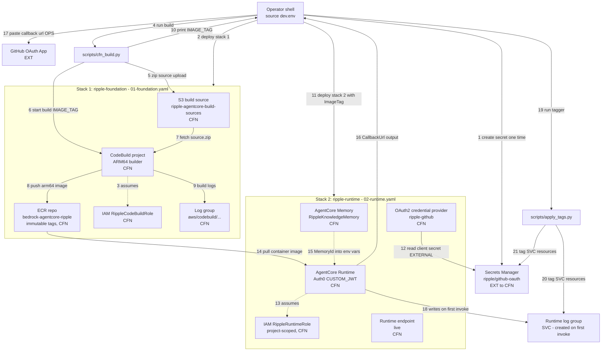
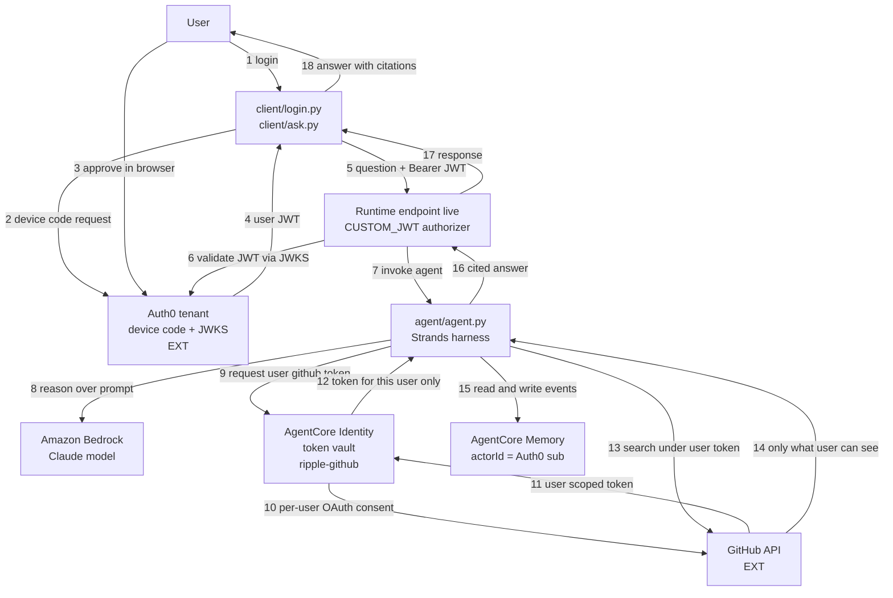

# Ripple — CloudFormation Architecture

Target architecture for the CloudFormation-based deployment (`infra/01-foundation.yaml`
+ `infra/02-runtime.yaml`). Every edge is numbered; the numbered tables below each
diagram are the authoritative text alternative.

Three views, kept separate because they answer different questions:

- **Component view.** What the pieces are and where the trust boundaries fall —
  the counterpart to the customer's own current-state diagram.
- **Diagram A — Deploy time.** What the operator runs; what CloudFormation creates.
- **Diagram B — Request time.** What happens when a user asks a question.

## PNG versions

Ready to open, no tooling needed:

| View | PNG |
|---|---|
| Component architecture | [`architecture-components.png`](architecture-components.png) |
| Diagram A — deploy time | [`architecture-a-deploy.png`](architecture-a-deploy.png) |
| Diagram B — request time | [`architecture-b-request.png`](architecture-b-request.png) |

The two flow PNGs are the numbered flows below drawn as sequence diagrams (one row
per edge, read top to bottom). The component PNG is a different shape — service
tiles and labelled connections, deliberately matching
`Ripple-slack-integration-architecture.png` so the two can be compared side by side.

```bash
open infra/architecture-components.png \
     infra/architecture-a-deploy.png infra/architecture-b-request.png
```

Regenerate:

```bash
python3 infra/render_diagrams.py           # both flow PNGs
python3 infra/render_diagrams.py --check   # assert edge numbers still match this file
python3 infra/render_components.py         # the component PNG
```

Both renderers use matplotlib only — no Node, no Docker, nothing leaves the machine.

`render_diagrams.py --check` compares the renderer's edge numbers against the
Mermaid blocks here and exits non-zero on drift, so the flow PNGs cannot silently
fall out of date. It runs automatically at the end of a normal render.

`render_components.py` refuses to write a PNG that fails any of its checks:

| Check | Catches |
|---|---|
| `trust_boundary_violations` | a node on the wrong side of the AWS account boundary |
| `zone_intrusions` | a zone box visually containing a tile that is not a member |
| `account_id_leaks` | an AWS account ID baked into a diagram meant to be shared |
| `arrows_through_tiles` | an arrow crossing a component it does not connect to |
| `missing_art` / `missing_glyphs` | a referenced icon file absent, or a glyph missing from the render font |
| (post-render) | overlapping text |

The first two matter most. `trust_boundary_violations` is what stops the dashed
account rectangle from claiming to contain Auth0 or GitHub; `zone_intrusions`
exists because an early draft drew CloudWatch inside the AgentCore box, asserting
CloudWatch is part of AgentCore rather than a service AgentCore reports into.

Every tile carries an official icon — AgentCore from the AWS AgentCore deck, AWS
services from the AWS Architecture Icons package, and Slack / GitHub / Auth0 from
their own brand marks. Provenance for each file is in
[`icons/SOURCE.md`](icons/SOURCE.md).

## Component architecture


Read it left to right — the columns are the trust boundary:

| Columns | Zone | Why it matters |
|---|---|---|
| 1–2 | Outside AWS: the user, their laptop, Auth0 | The JWT is minted by an IdP we do not host |
| 3–5 | The AWS account | Everything CloudFormation owns and cost-tags |
| 6 | Outside AWS: GitHub | The system of record, and the ACL authority |

Two arrows carry the security argument, and they are deliberately distinct:

- `AgentCore Runtime → token vault → GitHub` — the vault performs the per-user
  OAuth exchange and hands back a token scoped to **that one user**.
- `AgentCore Runtime → GitHub API` (the bowed arrow, drawn *around* the vault) —
  the agent then calls GitHub **directly** under that token. It is bowed rather
  than straight precisely so it cannot be misread as flowing through the vault.

The consequence is the whole point: GitHub itself trims the results, so the agent
has no path to widen a user's access even if the prompt asks it to.

## State model

**Every layer of this solution is stateless per request. That is a deliberate
choice, not an unfinished one.** It is worth stating plainly because a reader
looking at the diagram will see an AgentCore Memory tile and reasonably assume
conversations persist. They do not — the Memory resource is provisioned and
unused.

| Layer | Today | Where the switch is |
|---|---|---|
| CLI client | New session id every run, so no two invocations are grouped | `client/ask.py` — persist the id instead of minting it |
| Runtime entrypoint | Fresh `Agent` per invocation; reads no history, writes none | `agent/agent.py` `invoke()` — see the STATEFUL block in its docstring |
| AgentCore Memory | Created by `02-runtime.yaml`, id injected as `AGENTCORE_MEMORY_ID`, never read | No infra change needed; wire up the read/write |
| Tools Gateway (MCP) | Not built yet | Pin `supportedVersions` when built — see below |

What statelessness buys, concretely: any runtime instance can serve any turn, so
scaling out needs no sticky routing and a cold start loses nothing; and cross-user
bleed is impossible by construction, because there is no shared container for one
user's data to land in another user's turn.

What it costs: follow-up questions don't work. "What did I just ask?" gets nothing.

### The session id is not memory

`client/ask.py` sends `X-Amzn-Bedrock-AgentCore-Runtime-Session-Id`, and it would
be easy to read that as conversation state. It is not. The platform uses it to
group turns for observability and billing; `agent.py` never reads it, so it cannot
influence an answer. Grouping is not memory.

### Going stateful

The full recipe is in `invoke()`'s docstring in `agent/agent.py`, next to the code
it changes. Three things there are load-bearing and easy to get wrong:

1. **Take the conversation id from `context`, never from `payload`.** A
   client-supplied conversation id is a cross-user read primitive — anyone can
   pass someone else's.
2. **`user_sub` is the authorization boundary, the session id only separates
   conversations within it.** Scope by both; the JWT-derived `sub` is the one that
   makes it safe.
3. **Retrieved history is not a citable source.** Keep it out of the Sources list,
   or the confidence band starts vouching for the model's own earlier claims — a
   self-confirming loop.

Then budget it with a turn cap or token budget of your own. The Memory resource's
`EventExpiryDuration` (`MemoryExpiryDays`, default 90) caps *retention*, not
context size, so it won't help: unbounded history raises cost every turn and
eventually pushes the system prompt out of the window. And stored conversation is
user data, so deletion becomes a real code path.

### MCP 2026-07-28 and the Tools Gateway

The [MCP 2026-07-28 spec](https://aws.amazon.com/blogs/machine-learning/how-agentcore-gateway-supports-the-mcp-2026-07-28-spec/)
moved MCP in the same direction: protocol-level sessions are gone (no
`Mcp-Session-Id`, no `initialize` handshake), every tool call is self-contained,
and application state is carried in explicit tool parameters instead. Which means
our Tools Gateway needs no session infrastructure when we build it, and the
stateless design above is the one the protocol now assumes.

When the Gateway is built, **pin the version explicitly** — a Gateway created
without `supportedVersions` serves `2025-03-26` to any client that omits the
`MCP-Protocol-Version` header:

```bash
aws bedrock-agentcore-control update-gateway --gateway-identifier "$GW_ID" \
  --protocol-configuration '{"mcp":{"supportedVersions":["2025-11-25","2026-07-28"]}}'
```

Two traps. `update-gateway` **replaces** the array rather than appending, so send
the complete desired list or you silently drop a version a client still uses. And
version translation does not cover elicitation or sampling, so a `2025-*` client
calling a `2026-*` server tool that needs either fails with `-32021` — roll clients
forward before removing old versions. Changing the protocol version does not touch
the inbound authorizer or the outbound OAuth credential provider, so the per-user
GitHub token flow is unaffected.

### How to view the Mermaid source

The `mermaid` blocks below render natively in several places — no install:

- **GitHub / GitLab** — rendered automatically in the web UI for any `.md` file.
- **VS Code** — the built-in Markdown preview (`Cmd+Shift+V`) renders Mermaid as of
  VS Code 1.100; older versions need the *Markdown Preview Mermaid Support* extension.
- **<https://mermaid.live>** — paste a block's contents (without the ``` fences) and
  export PNG or SVG from the *Actions* panel. Note this sends the diagram to a
  third-party site; fine for this architecture, not for anything sensitive.
- **JetBrains IDEs** — Markdown preview with the Mermaid plugin enabled.

To generate PNGs from the Mermaid source itself rather than via
`render_diagrams.py`, you need Node (not currently installed on this machine):

```bash
brew install node
npx -y @mermaid-js/mermaid-cli -i infra/ARCHITECTURE.md -o /tmp/arch.md
# writes /tmp/arch-1.png and /tmp/arch-2.png, one per mermaid block
```

`render_diagrams.py` exists precisely so the PNGs do not depend on that: it uses
only matplotlib, works offline, and sends nothing to a third party.

Legend used throughout:

```
  [CFN]  created and owned by CloudFormation
  [SVC]  created by the AWS service at first use, tagged by scripts/apply_tags.py
  [EXT]  external to AWS and to CloudFormation
  [OPS]  a manual operator step
```

---

## Diagram A — Deploy time



### Diagram A — numbered edges (text alternative)

| # | From | To | What happens |
|---|---|---|---|
| 1 | Operator | Secrets Manager | One-time: create `ripple/github-oauth` holding `{"client_secret": ...}` |
| 2 | Operator | Stack 1 | `aws cloudformation deploy` → S3, ECR, CodeBuild, role, log group |
| 3 | CodeBuild | `RippleCodeBuildRole` | Assumes the build role (ECR push + S3 read only) |
| 4 | Operator | `cfn_build.py` | Starts the image build — the step CFN cannot do |
| 5 | `cfn_build.py` | S3 | Zips `Dockerfile`, `requirements.txt`, `agent/` → `ripple/source.zip` |
| 6 | `cfn_build.py` | CodeBuild | `start_build` with `IMAGE_TAG` = UTC timestamp |
| 7 | S3 | CodeBuild | CodeBuild fetches the source archive |
| 8 | CodeBuild | ECR | Builds `linux/arm64` image, pushes under the timestamp tag |
| 9 | CodeBuild | CodeBuild log group | Build logs, 30-day retention |
| 10 | `cfn_build.py` | Operator | Prints `IMAGE_TAG=<tag>` as the last line |
| 11 | Operator | Stack 2 | Deploys with `ImageTag`, Auth0 + GitHub params |
| 12 | Credential provider | Secrets Manager | Reads the secret via `ClientSecretSource=EXTERNAL` |
| 13 | Runtime | `RippleRuntimeRole` | Assumes the project-scoped execution role |
| 14 | ECR | Runtime | Runtime pulls the container image by `ContainerUri` |
| 15 | Memory | Runtime | `!GetAtt Memory.MemoryId` injected as an env var |
| 16 | Runtime stack | Operator | `GithubCallbackUrl` stack output |
| 17 | Operator | GitHub OAuth App | **Manual:** paste callback URL, else GitHub auth fails |
| 18 | Runtime | Runtime log group | Service creates the log group on first invoke |
| 19 | Operator | `apply_tags.py` | Tags what CFN cannot declare |
| 20 | `apply_tags.py` | Runtime log group | Applies `project_name=ripple_slack_assistant` |
| 21 | `apply_tags.py` | Secrets Manager | Applies the same tag to the Identity secret |

### Diagram A — ASCII fallback

```
  [OPS] Operator shell  (source dev.env)
     |
     | (1) create secret (one time)
     v
  +-------------------------------------------+
  |  Secrets Manager  ripple/github-oauth     |  [EXT to CFN]
  +-------------------------------------------+
     ^                                     ^
     | (12) read secret (EXTERNAL)         | (21) tag
     |                                     |
     |   (2) deploy stack 1
     |     +-------------------------------------------------+
     |     |  STACK 1  ripple-foundation                     |
     |     |                                                 |
     |     |  +-------------+   (3) assumes  +-------------+  |
     |     |  |  CodeBuild  | -------------> |  CB Role    |  |
     |     |  +-------------+                +-------------+  |
     |     |    ^   |    |                                    |
     |     |    |   |    +--- (9) logs ---> +-------------+   |
     |     |    |   |                       |  CB LogGrp  |   |
     |     |    |   |                       +-------------+   |
     |     |    |   +--- (8) push image --> +-------------+   |
     |     |    |                           |  ECR repo   |   |
     |     |    | (7) fetch source          +-------------+   |
     |     |  +-------------+                     |           |
     |     |  |  S3 source  |                     |           |
     |     |  +-------------+                     |           |
     |     +-------------------------------------------------+
     |           ^                                |
     |           | (5) upload zip                 | (14) pull image
     |           |                                |
     |     +-------------+                        |
     |     | cfn_build   | -- (6) start build     |
     |     +-------------+                        |
     |        ^     |                             |
     | (4) run|     | (10) print IMAGE_TAG        |
     |        |     v                             |
     |     [OPS] Operator                         |
     |           |                                |
     |           | (11) deploy stack 2            |
     |           v                                v
     |     +-------------------------------------------------+
     |     |  STACK 2  ripple-runtime                        |
     |     |                                                 |
     +-----|--- Credential provider  ripple-github           |
           |         |                                       |
           |  +-------------+  (13) assumes  +------------+   |
           |  |   Runtime   | -------------> |  RT Role   |   |
           |  +-------------+                +------------+   |
           |     ^      |                                     |
           |     |      | (16) CallbackUrl output             |
           |     | (15) MemoryId                              |
           |  +-------------+                                 |
           |  |   Memory    |                                 |
           |  +-------------+                                 |
           +-------------------------------------------------+
                    |                    |
                    | (18) first invoke  | (16) output
                    v                    v
           +------------------+     [OPS] Operator
           | Runtime LogGroup |          |
           |      [SVC]       |          | (17) paste callback URL
           +------------------+          v
                    ^              +------------------+
                    | (20) tag     | GitHub OAuth App |
                    |              |      [EXT]       |
           +------------------+    +------------------+
           |  apply_tags.py   |
           +------------------+
                    ^
                    | (19) run
              [OPS] Operator
```

---

## Diagram B — Request time

The security guarantee lives here: the runtime is the JWT-authenticated front door,
and GitHub is always read under the **calling user's own** OAuth token, so results
are ACL-trimmed by GitHub itself.



### Diagram B — numbered edges (text alternative)

| # | From | To | What happens |
|---|---|---|---|
| 1 | User | CLI | Runs `client/login.py` |
| 2 | CLI | Auth0 | Device code grant request |
| 3 | User | Auth0 | Approves in browser (`user_code` + `verification_uri`) |
| 4 | Auth0 | CLI | Returns the user's JWT, cached in `.token.json` |
| 5 | CLI | Runtime endpoint | `client/ask.py` POSTs the question, JWT as `Bearer` |
| 6 | Endpoint | Auth0 | `CUSTOM_JWT` authorizer validates signature, audience, issuer via JWKS |
| 7 | Endpoint | Agent | Invokes the container entrypoint |
| 8 | Agent | Bedrock | Strands calls the model; may loop with 9–15 |
| 9 | Agent | Token vault | `GetResourceOauth2Token` for the calling user |
| 10 | Token vault | GitHub | Per-user OAuth consent, first time only |
| 11 | GitHub | Token vault | User-scoped access token, stored in the vault |
| 12 | Token vault | Agent | Returns a token scoped to **this** user |
| 13 | Agent | GitHub | `github_tool` searches code, issues, PRs under that token |
| 14 | GitHub | Agent | Returns only repos that user can access — the ACL trim |
| 15 | Agent | Memory | Events partitioned by `actorId` = Auth0 `sub` |
| 16 | Agent | Endpoint | Cited, confidence-scored answer |
| 17 | Endpoint | CLI | HTTP response |
| 18 | CLI | User | Prints the answer with citations |

### Diagram B — ASCII fallback

```
  +--------+
  |  User  |
  +--------+
     |    ^
 (1) |    | (18) answer with citations
     v    |
  +----------------------+
  |  CLI login / ask     |
  +----------------------+
     |    ^          |    ^
 (2) |    | (4) JWT  |    | (17) response
     v    |          |    |
  +----------------------+ |
  |  Auth0 tenant  [EXT] | |     <--- (3) user approves in browser
  +----------------------+ |
     ^                     |
     | (6) validate JWKS   | (5) question + Bearer JWT
     |                     v
  +---------------------------------------------+
  |  Runtime endpoint  live                     |
  |  CUSTOM_JWT authorizer = the front door     |
  +---------------------------------------------+
                  |               ^
              (7) | invoke        | (16) cited answer
                  v               |
  +---------------------------------------------+
  |  agent/agent.py    Strands harness          |
  +---------------------------------------------+
     |         |            |             |
 (8) |     (9) |       (13) |        (15) |
     v         v            v             v
  +--------+ +-----------+ +--------+ +-----------+
  |Bedrock | |Token vault| |GitHub  | |  Memory   |
  | model  | |  ripple-  | | API    | | actorId = |
  |        | |  github   | | [EXT]  | | Auth0 sub |
  +--------+ +-----------+ +--------+ +-----------+
                  |    ^       ^  |
            (10)  |    | (11)  |  | (14) only what
            consent    | token |  |      user can see
                  v    |       |  v
              +--------------+  (13) search under
              | GitHub OAuth |       user token
              |    [EXT]     |
              +--------------+
                  |
                  | (12) token for THIS user only --> agent
```

---

## Why the ownership boundaries in Diagram A matter

The `[CFN]` / `[SVC]` / `[EXT]` split is not cosmetic — it is what makes the cost
tag and the IAM scoping truthful:

- **`[CFN]` resources have exactly one owner.** Each stack declares its own role,
  so `project_name=ripple_slack_assistant` is simply true. Contrast the
  toolkit-created `AgentCoreRuntimeRole`, shared by four runtimes and therefore
  untaggable. See `README.md` → *Why the shared role couldn't be tagged*.
- **`[SVC]` resources cannot be declared** because their names embed
  service-generated IDs (edge 18: the runtime log group name contains the runtime
  ID). Hence edges 19–21.
- **`[EXT]` boundaries are where manual steps live.** Edge 17 is the only step that
  blocks a cutover, and only because replacing the credential provider issues a new
  callback URL.

Edge 15 also shows why CFN tightens IAM: because `!GetAtt Memory.MemoryArn` resolves
during deploy, the runtime role grants Memory access to *this* memory rather than
`memory/*`, which today would reach four unrelated projects' stores.
